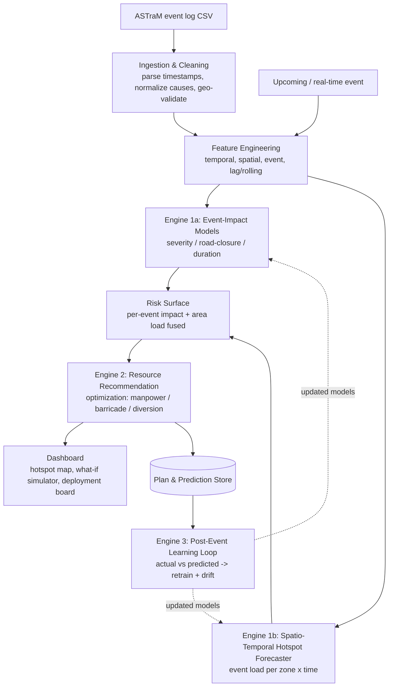
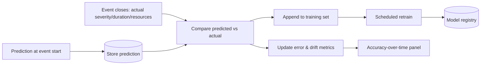
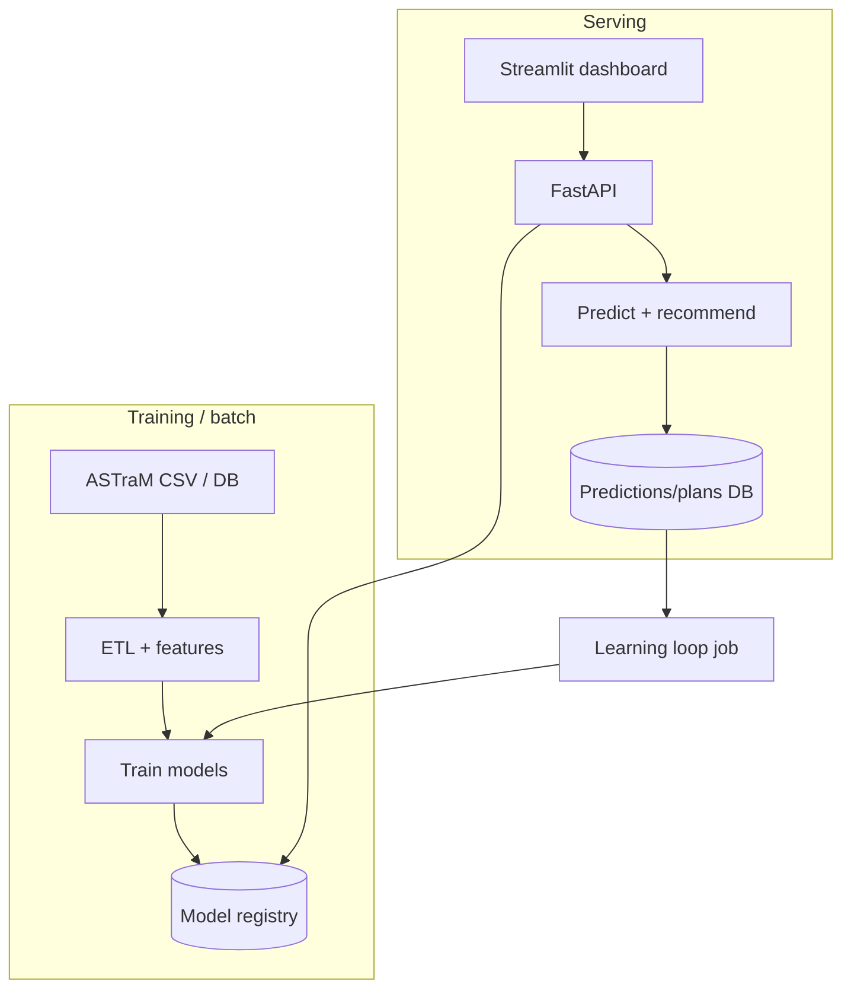

# System Architecture — Event-Driven Congestion Forecasting & Resource Optimizer

> Companion to [`CONCEPT_NOTE.md`](./CONCEPT_NOTE.md). Full technical architecture: data pipeline,
> feature engineering, the three model engines, the optimization formulation, the learning loop, and
> the proposed stack. Grounded in the **ASTraM dataset** (8,173 events, Bengaluru, Nov 2023 – Apr
> 2024). No GPU required — this is data engineering + classical ML + optimization.

---

## 1. Design principles

1. **Predict, then optimize, then learn.** Three stages: forecast impact → recommend a resource plan →
   feed actuals back. Each is independently testable.
2. **Time-aware everything.** All validation uses time-based splits (past → future). No future
   information leaks into training.
3. **Honest proxies.** No vehicle-flow data exists, so "impact" = `priority` + `requires_road_closure`
   + clearance `duration`. These are the quantities a deployment plan actually needs.
4. **Actionable output.** The deliverable is a plan (manpower/barricade/diversion), not a chart.
5. **Self-improving.** Closed events become training data automatically.

---

## 2. End-to-end pipeline



---

## 3. Data model & cleaning

### 3.1 Source fields used

| Group | Fields |
|-------|--------|
| Identity/type | `id`, `event_type` (planned/unplanned), `event_cause` |
| Geo | `latitude`, `longitude`, `corridor`, `zone`, `junction`, `address` |
| Time | `start_datetime`, `end_datetime`, `resolved_datetime`, `closed_datetime`, `modified_datetime` |
| Impact labels | `priority`, `requires_road_closure`, derived `duration_min` |
| Resource | `police_station`, `assigned_to_police_id`, `route_path`, `direction`, `veh_type` |
| Status | `status` (active/closed/resolved) |

### 3.2 Cleaning rules

- **Timestamps:** parse ISO strings; treat `NULL`/empty as missing.
- **`duration_min`** = `coalesce(resolved_datetime, closed_datetime, end_datetime, modified_datetime) − start_datetime`,
  clipped to `[0, 48h]`; flag rows where only `modified_datetime` was available (lower confidence).
- **`event_cause`:** normalize case/spelling (`Debris`→`debris`, `Fog / Low Visibility`→`fog`).
- **Geo validation:** drop rows with `lat/long = 0` or out of Bengaluru bbox for spatial models; keep
  `corridor`/`zone` as the coarse spatial key when point geo is bad.
- **`zone` NULL (4,723 rows):** backfill from `corridor`→`zone` mapping where derivable; else `unknown`.

---

## 4. Feature engineering

| Family | Features |
|--------|----------|
| **Temporal** | hour, day-of-week, is_weekend, month, is_holiday/festival (external calendar), part-of-day bucket |
| **Spatial** | corridor, zone, junction, **H3 hex cell** (from lat/long, res ~8–9) for grid forecasting |
| **Event** | event_type, event_cause, veh_type, is_event_driven (public_event/procession/vip/protest/construction) |
| **Lag / rolling (for hotspot model)** | events in same cell in last 1h/3h/24h/7d; rolling mean severity; same-hour-last-week count |
| **Context** | corridor historical avg duration, zone historical High-priority rate |

---

## 5. Engine 1a — Event-impact models

Three models sharing the feature set, one row per event:

| Model | Target | Type | Metric |
|-------|--------|------|--------|
| Severity | `priority` ∈ {High, Low} | LightGBM binary classifier | F1, ROC-AUC |
| Road-closure | `requires_road_closure` ∈ {T, F} | LightGBM classifier (class-weighted; 676/8173 positive) | PR-AUC, Recall |
| Clearance duration | `duration_min` | LightGBM regressor (log-target) | MAE, RMSE |

- **Imbalance:** class weights / `scale_pos_weight`; report PR curves not just accuracy.
- **Explainability:** SHAP values surfaced in the dashboard ("why High priority: cause=accident,
  corridor=Mysore Road, hour=18").

## 6. Engine 1b — Spatio-temporal hotspot forecaster

- **Aggregation grid:** (spatial key × time bucket). Spatial key = corridor *or* H3 cell; time bucket
  = hourly or 3-hourly.
- **Target:** event count (and severity-weighted count) per cell per bucket.
- **Model:** global LightGBM regressor over lag/calendar/spatial features (handles many sparse cells
  better than per-series Prophet); Prophet/statsforecast as a per-corridor baseline.
- **Output:** forecasted load for the next horizon (e.g. next 24h), per cell → the **risk surface**.


## 7. Engine 2 — Resource recommendation (optimization)

Converts the risk surface + per-event impact into a deployable plan.

### 7.1 Inputs
- Forecasted events per zone/time with predicted severity & road-closure probability.
- Available resources (configurable): total officers per zone, barricade units, known diversion routes
  per corridor (from historical `route_path`/`direction`).

### 7.2 Manpower allocation (optimization)
Allocate limited officers across zones to maximize weighted coverage of predicted demand:

```
maximize  Σ_z  severity_weight_z · covered_demand_z
subject to Σ_z officers_z ≤ TOTAL_OFFICERS
           officers_z ≥ min_floor_z   (baseline presence)
           covered_demand_z ≤ f(officers_z)   (diminishing returns)
```

Solved with **OR-Tools / PuLP** (LP/ILP). Falls back to a transparent **priority-weighted greedy**
allocation if a solver isn't available.

### 7.3 Barricading
For each predicted event with `road_closure_prob ≥ τ`, emit a **barricade recommendation** at its
junction/corridor, sized by predicted severity.

### 7.4 Diversion
For corridors with high predicted closure/load, suggest diversions mined from historical
`route_path`/`direction` on similar past events at that corridor (case-based retrieval).

## 8. Engine 3 — Post-event learning loop



- Stores every prediction; on closure, computes error; periodically retrains; tracks drift so degraded
  performance is visible.

## 9. Deployment topology



## 10. Proposed tech stack

| Concern | Choice | Why |
|---------|--------|-----|
| Language | Python 3.11+ | data/ML ecosystem |
| Data wrangling | pandas, NumPy | core ETL |
| ML models | **LightGBM** (+ scikit-learn) | fast, strong on tabular, handles missing/categoricals |
| Time-series baseline | Prophet / statsforecast | per-corridor baseline |
| Geospatial | geopandas, shapely, **H3** | spatial indexing & joins |
| Optimization | **OR-Tools** or PuLP | manpower allocation |
| Explainability | SHAP | trust in predictions |
| API | FastAPI + Uvicorn | serving |
| Dashboard | **Streamlit** + pydeck/folium | maps, what-if, deployment board |
| Storage | SQLite/PostgreSQL + Parquet | records + feature store |
| Scheduling | APScheduler / cron | retrain & forecast jobs |
| Packaging | Docker | reproducible |

> **No GPU needed** — everything runs comfortably on CPU.

## 11. Evaluation harness

| Component | Metric | Split |
|-----------|--------|-------|
| Severity classifier | Accuracy, P/R/F1, ROC-AUC | time-based (train ≤ Feb, test Mar–Apr) |
| Road-closure classifier | PR-AUC, Recall@precision | time-based |
| Duration regressor | MAE, RMSE, median AE | time-based |
| Hotspot forecaster | MAE/RMSE, Precision@K hotspots | rolling-origin backtest |
| Resource recommender | High-priority coverage %, vs greedy baseline | historical replay |

## 12. Open questions for the build

- Available manpower/barricade capacity per zone — configurable assumption vs real roster.
- External calendar (festivals, match schedules, holidays) — fetch/curate for richer event features.
- Spatial key: corridor (clean, coarse) vs H3 cell (fine, needs valid lat/long) — likely both.
- Real-time feed format if this moves beyond historical CSV.
